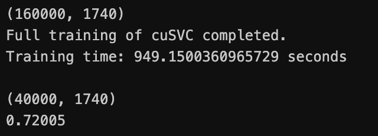

# COMP3314 Machine Learning 
# Assignment 3 Report

#### Team members:

**Xiao Yuxuan**			*3035974389*

**Cheung Ching Pan** 	*3036101721*

**Cheung Man Hei Kay**	*3036106109*

## Environment Requirements
- Linux (WSL2 included) with NVIDIA GPU
- CUDA 12.0+ (recommended: 12.5+), CUDA Toolkit and Driver
- Python 3.10-3.12
- RAPIDS libraries (cuml >= 25.0.*)
- OpenCV, NumPy, Pandas, scikit-image, scikit-learn

## Dataset analysis
### Dataset overview
The dataset consists of labeled image files for training and unlabeled files for testing:
- `train.csv` contains image names *(im_name)* and their corresponding labels.
- `test.csv` contains image names for which predictions are required.
- Image files are located in `train_ims/` and `test_ims/`.

The dataset has 10 distinctive labels. Following are the visualizations of examples of each category:


### Dataset preprocessing
#### Dataset augmentation
The training set is augmented by flipping the images horizontally and vertically, and both horizontally and vertically.

The shape of the augmented dataset should be `(200000, 16, 16, 3)`, while what of the original dataset is `(50000, 16, 16, 3)`.

#### Split the train dataset
The training set is split into a train set and validation set with 20% of the training set being the validation set.
- Shape of the train set: `(160000, 16, 16, 3)`
- Shape of the validation set: `(40000, 16, 16, 3)`

#### Preprocessing
We have extracted the HOG *(Histogram of Oriented Gradients)* features from three channels of each image. The HOG features are computed using the following parameters:
- `pixels_per_cell`: $8$
- `cells_per_block`: $2$
- `orientations`: $9$
- `visualize`: `False`

Then, we concatenate the flattened image and the HOG features into a single feature vector. The shape of the feature vector is `(,1740)`.

```python
from skimage.feature import hog
from sklearn.base import BaseEstimator, TransformerMixin
import numpy as np
import cv2 as cv

class Preprocessor(BaseEstimator, TransformerMixin):
    def __init__(self):
        super().__init__()
    def fit(self, X, y=None):
        return self
    def transform(self, X):
        features = []
        for image in X:
            r, g, b = cv.split(image)
            hog_r = hog(r, orientations=9, pixels_per_cell=(8, 8),
                        cells_per_block=(2, 2), visualize=False)
            hog_g = hog(g, orientations=9, pixels_per_cell=(8, 8), 
                        cells_per_block=(2, 2), visualize=False)
            hog_b = hog(b, orientations=9, pixels_per_cell=(8, 8), 
                        cells_per_block=(2, 2), visualize=False)
            hog_features = np.concatenate((hog_r, hog_g, hog_b))
            
            image = cv.resize(image, (16,16))
            feature = np.hstack((image.flatten(), hog_features))
            features.append(feature)
        features = np.array(features)
        print(features.shape)
        return features
```
- Shape of the train set: `(160000, 1740)`
- Shape of the validation set: `(40000, 1740)`

## Classifier exploration
### Support Vector Machine (SVM)
- Implementation:
```python
from cuml.metrics import accuracy_score
from cuml.pipeline import Pipeline
from cuml.preprocessing import StandardScaler
from cuml.svm import SVC
pipeline = Pipeline([
    ('preprocessor', Preprocessor()),
    ('scaler', StandardScaler()),
    ('classifier', SVC(kernel='rbf', C=10, gamma='scale', random_state=42))
])
start_time = time.time()
pipeline1.fit(X_train, y_train)
end_time = time.time()
print("Full training of cuSVC completed.")
print(f"Training time: {end_time - start_time} seconds")
y_test_pred = pipeline1.predict(X_test)
print(accuracy_score(y_test, y_test_pred))
```

- result:


*The test is run on the HKU GPU Farm Phase 1. Flags: `-p q3090 -gres=gpu:rtx3090:2 --cpus-per-task=8`.*

### Random Forest (RF)
- Implementation:
```python
from cuml.ensemble import RF
pipeline = Pipeline([
    ('preprocessor', Preprocessor()),
    ('scaler', StandardScaler()),
    ('classifier', RF(n_estimator=100, max_depth=16, random_state=42))
])
start_time = time.time()
pipeline.fit(X_train, y_train)
end_time = time.time()
print("Full training of cuRF completed.")
print(f"Training time: {end_time - start_time} seconds")
y_test_pred = pipeline1.predict(X_test)
print(accuracy_score(y_test, y_test_pred))
```

- result:


*The test is run on the HKU GPU Farm Phase 1. Flags: `-p q3090 -gres=gpu:rtx3090:2 --cpus-per-task=8`.*

### Discussion
Though random forest is way more faster the SVM classifier, the accuracy of the SVM classifier is much higher than that of the RF classifier. The SVM classifier achieves an accuracy of $72\%$, while the RF classifier achieves only an accuracy of $51.72\%$.

Therefore, with the trade-off between accuracy and training time, we choose the SVM classifier as our final classifier. 

## Final solution description
As [previously discussed](#discussion), the SVM classifier is better than the RF classifier.

To summarize, the final solution is as follows:
- [**Augmentation**](#dataset-augmentation): The training set is augmented by flipping the images horizontally and vertically, and both horizontally and vertically.
- [**Preprocessing**](#dataset-preprocessing): HOG features are extracted from the images and concatenated with the flattened image.
- **Classifier**: The SVM classifier is used with the following parameters:

| Parameter | Value |
| --------- | ----- |
| kernel    | rbf   |
| C         | To be fine tuned |
| gamma     | scale |
| random_state | 42    |

It is worthing noting that the splitting in the final solution is no longer used, as the final solution is trained on the whole training set. The validation set is used to fine tune the parameters of the SVM classifier.

Under a comprehensive evaluation based on accuracy and training time, `C` is set to 30, which leads to a highest accuracy under a reasonable training time.

- **Final accuracy**: 0.7225. *(based on Kaggle result)*
